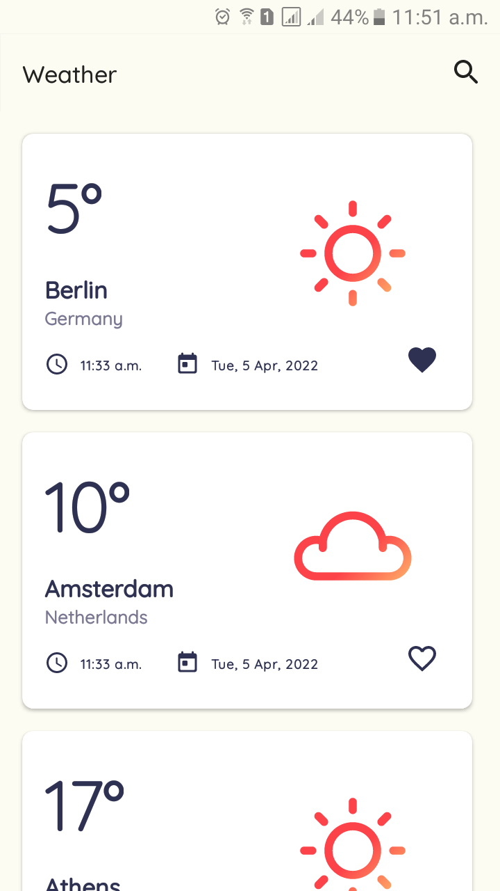
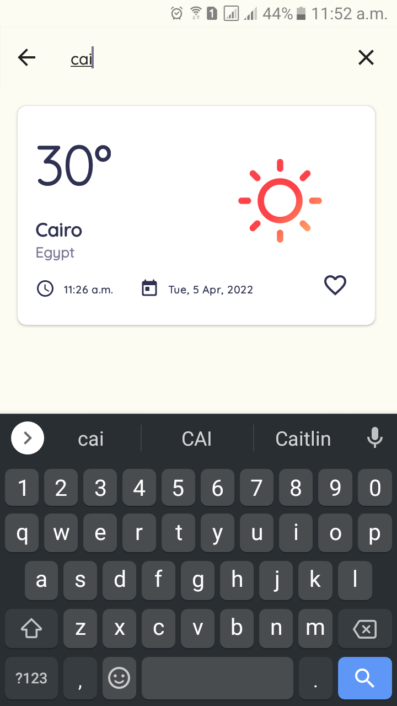
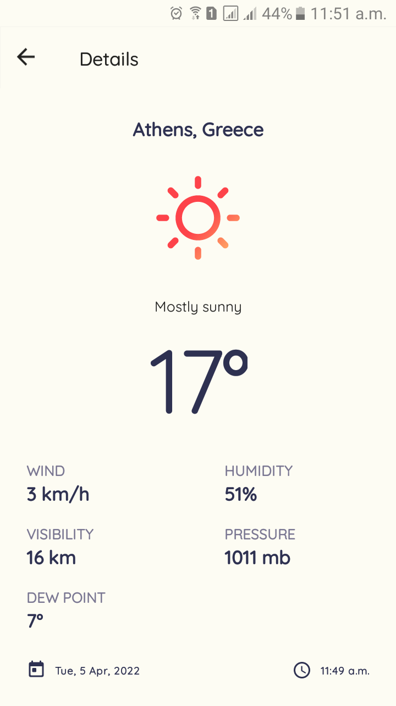

# Weather App - TopUp Mama mobile assessment.
A weather application that displays the current weather.

## Tech stack and Libraries
* Architecture
  * MVVM (Model-View-ViewModel)
  * Repository pattern
* Architecture components
  * [WorkManager](https://developer.android.com/topic/libraries/architecture/workmanager) - Schedule background work that's deferrable and requires guaranteed execution.
  * [Lifecycles](https://developer.android.com/topic/libraries/architecture/lifecycle) - Create a UI that automatically responds to lifecycle events.
  * [LiveData](https://developer.android.com/topic/libraries/architecture/livedata) - Build data objects that notify views when the underlying database changes.
  * [ViewModel](https://developer.android.com/topic/libraries/architecture/viewmodel) - Store UI-related data that isn't destroyed on app rotations. Easily schedule asynchronous tasks for optimal execution.
* Third party libraries 
  * [Retrofit](https://square.github.io/retrofit/) - a type-safe REST client for Android
  * [Moshi](https://github.com/square/moshi) - for parsing JSON into Java objects.
  * [Room](https://github.com/square/moshi) - for persisting data locally.
  * [Kotlin Coroutines](https://kotlinlang.org/docs/coroutines-overview.html) - for managing background threads with simplified code and reducing needs for callbacks.
  * [Timber](https://github.com/JakeWharton/timber) - a logging library for Android
 * API
   * Uses [AccuWeather APIs](https://developer.accuweather.com/) to get weather data.
 ## Download
 Go to the [Releases](https://github.com/davidwekesar/weather-app/releases) to download the latest APK.

## Screenshots

  
  
  

